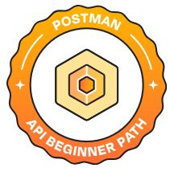
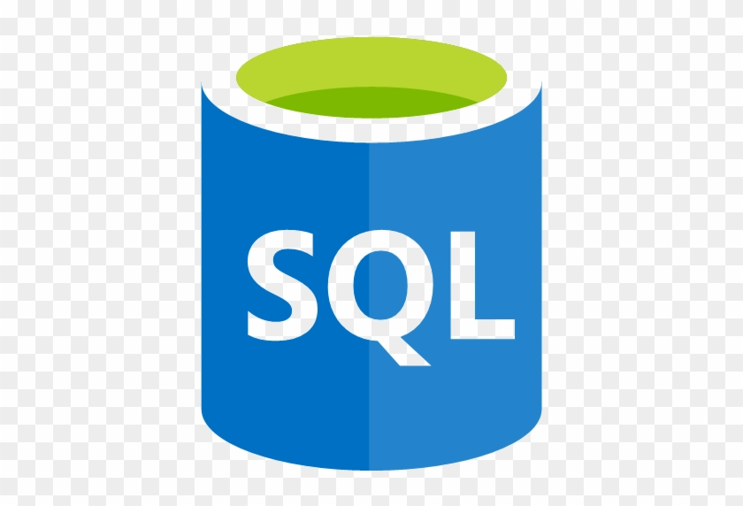
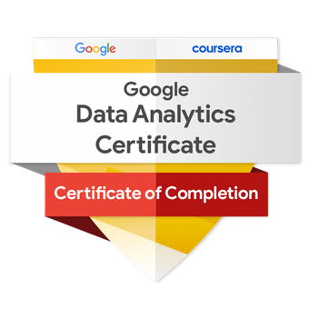
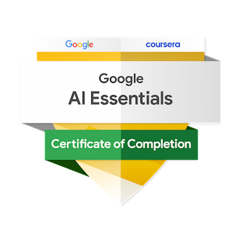

## About me!
I'm a final-year Management Information System (MIS) at Ho Chi Minh city of Banking university, pursuing Business Analyst career. To be a good Business Analyst, I have learnt projects regarding Data analysis, UX/UI, and also basic understanding of RESTapi in HTTP protocol.

  <a href="https://ux-portfolio-00e467.webflow.io/">
    
     
  </a>

  

### 📜 LANGUAGES & OFFICE INFORMATICS TESTIMONIALS:

| LANGUAGES | OFFICE INFORMATICS |
| :--- | :--- |
| **TOEIC**   [825/990 L+R](https://drive.google.com/file/d/1MF7_msCfa_AIiwWhlKJopG7KKr5-5laJ/view?usp=drive_link) | **MOS 2019 - Specialist (Excel, PowerPoint, Word)**    • [Microsoft Word Specialist 2019](https://drive.google.com/file/d/1PualKH2xM1FnVP9ag2BNruroeMpwxGT9/view?usp=drive_link)   • [Microsoft Excel Specialist 2019](https://drive.google.com/file/d/1omrOWr1FdWvWzT6c4J6iOQybP2-xwVgr/view?usp=drive_link)   • [Microsoft PowerPoint Specialist 2019](https://drive.google.com/file/d/1WR13LBj6Vm7v0I8HHej5seQdta-4u27b/view?usp=drive_link) |

### 🥇 Hand-On Projects:

| TOOL | TITLE | RECAPITULATION | PROJECT |
| :--- | :--- | :--- | :--- |
|  **POSTMAN API** |  Project-Based Learning: A weather app in Python | This project is my first step into the world of Business Analysis and software development. I designed a weather app, showcasing my skills in API basic understanding. |  [Click here to Find out](https://github.com/TrangDataforlife/Connected_OpenWeather_API_WeatherApp) |
|  **Figma, Stitch, StartUML, and Draw.io** |  Project-Teamwork Based Learning: A Sales Management System for an fictional online vegetable store, Family Farm | This project is my academic project,working in a team to do this big homework, INFORMATION SYSTEM ANALYSIS AND DESIGN, from analyze business requirements, design use case diagram, DFDs - BPMN, ERD, and Prototype. |  [Click here to Find out](https://github.com/TrangDataforlife/Information_Systems_Analysis_and_Design) |
|  **FIGMA** |  Lib-space app, Seeking A Place To Use Library Space Conveniently, And Fast. | As a part of self-study, I created an end2end UX project. Our Lib-seat app will let users monitor the library space in real-time, easily, and conveniently. This will affect students who want to use library services by allowing them to observe the library space effortlessly to find an empty seat for themselves. We will measure the effectiveness by the satisfaction, the sentiment, and the number of students using library services in surveys. |  [Click here to Find out](https://www.figma.com/proto/ZpeZz0pleU37NDXHjpr5t1/Lib-Space-HUB?node-id=29-27&t=eW4RsL2v1etZJT8y-1&scaling=scale-down&content-scaling=fixed&page-id=0%3A1&starting-point-node-id=29%3A27&show-proto-sidebar=1) |
|  **BALSAMIQ** |  Weather website wireframe | A wireframe using balsamiq helped me "draw" quickly my idea which was about weather website beyond weather app in Python, lauching a web for everyone easily use |  [Click here to Find out](https://balsamiq.cloud/s8c8m8e/pwfutf3) |
|  **JIRA** |  JIRA Practices | I have already learn JIRA tools to apply Agile philosophy to achieve deeply understand|  [Click here to Find out learning source](https://community.atlassian.com/learning/collection/certification-prep/jira-software-essentials-prep) |
|  **Power BI** |  HR analysis dashboard | this project, showcasing my skills in data handling, and user-centric, sharpened my analytical thinking and problem-solving more by challenging my initial questions to find out which right questions need to ask.|  [Click here to Find out](https://github.com/TrangDataforlife/HR_Dashboard) |

### 🥇 My Self-learning TESTIMONIAL:

| IT BA TOOLKITS | GENRE | TESTIMONIAL |
| :---: | :---: | :--- |
|  | Certificate | Get the most out of Google Agile Essentials   [View Certificate](https://www.coursera.org/account/accomplishments/specialization/93RTQLJUZ9PA?utm_source=link&utm_medium=certificate&utm_content=cert_image&utm_campaign=sharing_cta&utm_product=s12n) |
| | Badge | **Agile Badge**   [View Badge](https://www.credly.com/badges/be57c282-708e-4c6e-8d77-fab43fcad02d) |
|  | Certificate | Get the most out of Postman id: 69e60ed84a8ef58e25531b65   [View Certificate](Postman_cert.JPG) |
|  | Certificate | Get the most out of SQL - Intermediate Hackerrank   [View Certificate](https://www.hackerrank.com/certificates/iframe/284f95144627) |
|  | Certificate | Get the most out of Google Data Analytics Profession   [View Certificate](https://coursera.org/share/443949fc903e2df4934bb92b2474b70e) |
| | Badge | **Data Analytics Professional Badge**   [View Badge](https://www.credly.com/earner/earned/badge/884fd356-c3dd-4c6b-81d6-79feaec673bb) |
|  | Certificate | Get the most out of Digital Marketing Profession   [View Certificate](https://coursera.org/share/1a83ea1c580f5a103bcbda9225415415) |
| | Badge | **Digital Marketing & E-commerce Badge**   [View Badge](https://www.credly.com/earner/earned/badge/90fe982b-53c4-4b09-b037-dd7d55990649) |
|  | Certificate | Get the most out of Digital Marketing Profession   [View Certificate](https://www.coursera.org/account/accomplishments/verify/BFQNAH1IO5VP) |
| | Badge | **AI Badge**   [View Badge](https://www.credly.com/badges/6dd4cd42-6162-4f1d-9372-302d6999504d) |

## 🔗 Let's Connect
* 🌐 **Website Portfolio:** [Visit My Website](https://ux-portfolio-00e467.webflow.io/)
* 💼 **LinkedIn:** [linkedin.com/in/trangnguyen](https://www.linkedin.com/in/nguyenhaphuongtrang/)
* 📧 **Email:** phuongtrangnguyenha.work@gmail.com
