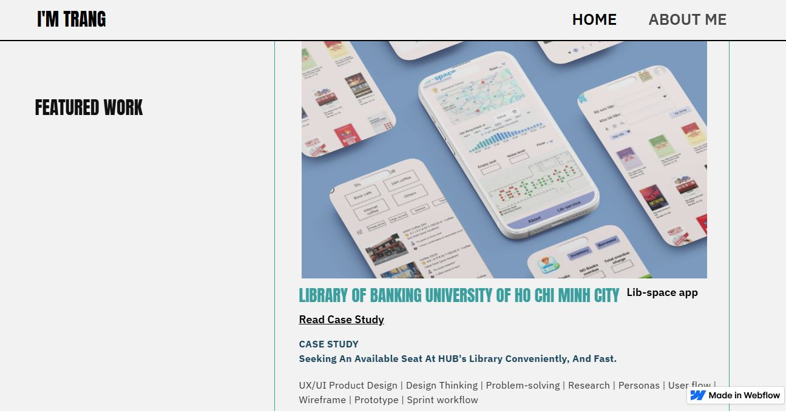

## About me!
I'm a final-year Management Information System (MIS), minor in E-commerce management student at Ho Chi Minh city of Banking university, waiting for graduation in August, 2026, and pursuing Analytics Engineer long-term career. 

**My projects** regarding:
1. Data Build Tool (dbt) hands-on projects
2. Data analysis in Customer shopping behaviour, Digital Ads, and HR with PostgreSQL, Python, PowerBI;
3. Product design: UI/UX; design thinking with Draw.io, Balsamiq, Figma, StartUML, and Google Stitch tools;
4. AI Product in Recruitment process;
5. Basic understanding of RESTapi in HTTP protocol with Postman;
6. E-commerce fictional shop which operated on Shopify - Academic project;
7. Scrum stimulation role.

**My relevant course certificates**: 
TOEIC 4 Skills, Google AI essentials, Googld Digital marketing & E-commerce, Google Data Analyst, Quantitative Analysis, Google Project Management, Claude 101, PostmanAPI, SQL-intermediate hackerrank.

My personal projects and certificates are attatched below, please take your time to look through. I hope we can work together if I have oppotunities.

*Some file pdf first you maybe encounter "unable to render" after clicking, please reload page or download file pdf.

### 📜 LANGUAGES & OFFICE INFORMATICS TESTIMONIALS:

| LANGUAGES | OFFICE INFORMATICS |
| :--- | :--- |
| **TOEIC**   [825/990 L+R & 320/400 S+W](https://drive.google.com/file/d/1sIk_gmI7wYqdhyTSFz_RJw5nsV6aeu_Q/view?usp=sharing)| **MOS 2016 - Specialist (Excel, PowerPoint, Word)**    • [Microsoft Word Specialist 2016](https://drive.google.com/file/d/1PualKH2xM1FnVP9ag2BNruroeMpwxGT9/view?usp=drive_link)   • [Microsoft Excel Specialist 2016](https://drive.google.com/file/d/1omrOWr1FdWvWzT6c4J6iOQybP2-xwVgr/view?usp=drive_link)   • [Microsoft PowerPoint Specialist 2016](https://drive.google.com/file/d/1WR13LBj6Vm7v0I8HHej5seQdta-4u27b/view?usp=drive_link) |

### 🥇 My Self-learning TESTIMONIAL:

| IT DA/BA TOOLKITS | GENRE | TESTIMONIAL |
| :---: | :---: | :--- |
| **Data Build Tool (dbt)** | 1. Certificate | dbt Fundamentals - dbt labs Certificate   [View Certificate](https://credentials.getdbt.com/b555353d-be5e-4ead-a644-63345152fb3a#acc.4cK3QRie) |
| **Python** | 2. Certificate | Crash Course On Python - Coursera Certificate   [View Certificate](https://coursera.org/share/402da06fb2f9a4f2e9b19f6d9137d9d1) |
| **AI Essentials**| 3. Certificate | AI fundamentals - Coursera   [View Certificate](https://www.coursera.org/account/accomplishments/verify/BFQNAH1IO5VP) |
| **Claude 101** | 4. Certificate | Claude 101 - Anthropic Certificate   [View Certificate](certificate_claude.pdf) |
| Data Analytics Professional Google| 5. Certificate | Get the most out of Google Data Analytics Profession   [View Certificate](https://coursera.org/share/443949fc903e2df4934bb92b2474b70e) |
| Digital marketing & E-commerce Google | 6. Certificate | Get the most out of Digital Marketing Profession   [View Certificate](https://coursera.org/share/1a83ea1c580f5a103bcbda9225415415) |
| SQL | 7. Certificate | SQL - Intermediate Hackerrank   [View Certificate](https://www.hackerrank.com/certificates/iframe/284f95144627) |
| **Quantitative Analysis** | 8. Certificate | Quantitative Techniques Certificate - Columbia+   [View Certificate](https://images.credential.net/embed/47yhsf7p_1781027352398.png) |
| Agile methodology | 9. Certificate | Get the most out of Google Agile Essentials   [View Certificate](https://www.coursera.org/account/accomplishments/specialization/93RTQLJUZ9PA?utm_source=link&utm_medium=certificate&utm_content=cert_image&utm_campaign=sharing_cta&utm_product=s12n) |
| Agile Project Management with Jira Cloud | 10. Certificate on Linkedln |  
| | |   [View Certificate Projects, Boards, Issues](https://www.linkedin.com/learning/certificates/8b15db94aeaf3e5e4c36e749f4920ad147c90d64b32e697738e2a8de52e719b2) |
| Postman | 11. Certificate | Get the most out of Postman id: 69e60ed84a8ef58e25531b65   [View Certificate](Postman_cert.JPG) |
| **Project Management** | 12. Certificate | Google Project Management Professional Certificate   [View Certificate](https://www.coursera.org/account/accomplishments/specialization/9EH20KD7OCLC) |

### 🥇 Business Project:

| TITLE | RECAPITULATION | PROJECT |
| :--- | :--- | :--- |
|  **Aomen shop** | a project about fashion business for male on e-commerce, specifically Shopify platform, which our team built in an e-commerce management course in university, including business canvas model, marketing plan, ... I was in charge of market research, assist with team in building a fictional shop business model, planning digital marketing plan, and operating fashion store on the Shopify platform, including product uploads.|  [Click here to Find out](https://drive.google.com/file/d/1jhWhHeDzSyX1aMxwFkYmMHcP173bS1_r/view?usp=sharing) |

### 🥇 Hand-On Projects:

| TOOL | TITLE | RECAPITULATION | PROJECT |
| :--- | :--- | :--- | :--- |
|  **dbt + Snowflake** |  | this project I built in dbt fundamentals course. Credit: dbt labs |  [Click here to Find out](https://github.com/TrangDataforlife/dbt_fundamentals) |
|  **Power BI, SQL, Python** |  Customer shopping behaviour analysis | this project, showcasing my foundation data analysis skills in PostgreSQL, Python, Power BI, and findings presentation.|  [Click here to Find out](https://github.com/TrangDataforlife/customer_trends_data_analysis_PostgreSQL_Python_PowerBI/tree/main) |
| | HR analysis dashboard | this project, showcasing my foundation data analysis skills in Power BI, and findings presentation. |  [Click here to Find out](https://github.com/TrangDataforlife/HR_Dashboard) |
| | Digital Marketing Performance Analysis | Here I used to archive my data analysis projects with Notion|   [My Data Analyst Portfolio](https://app.notion.com/p/Data-Analyst-Portfolio-practice-tool-21d8ba8ff45c80f1b741c2dae08d7a9a)|
|  **Google Stitch, and Draw.io** |  [AI Recruiment Suit] Entry test for Product owner at Edtronaut. Using Google Stitch & Draw.io |AI Suite được thiết kế nhằm tối ưu hóa quy trình tuyển dụng thông qua việc tối ưu hóa lợi ích trên hành trình ứng tuyển và hỗ trợ đánh giá năng lực ứng viên với các bài mô phỏng thực chiến. Bằng cách cung cấp báo cáo chi tiết về năng lực ứng viên với dữ liệu định lượng,giải pháp giúp nhà tuyển dụng xử lý hàng trăm CV mỗi tuần một cách dễ dàng và lựa chọn được nhân tài phù hợp nhất. Đo lường hiệu quả sản phẩm qua việc rút ngắn thời gian lọc hồ sơ, thời gian tuyển dụng (Time-to-hire), hiệu suất làm việc và mức độ gắn kết của nhân viên sau khi nhận việc.|  [Click here to Find out](https://drive.google.com/file/d/1vzIVHC3XRhbQ7GMbFOMao1jgCOVIFU89/view?usp=sharing) |
|  **POSTMAN API & PYTHON** |  Project-Based Learning: A weather app in Python | This project is my first step into the world of Business Analysis and software development. I designed a weather app, showcasing my skills in API basic understanding. Credit: Coding with Evan |  [Click here to Find out](https://github.com/TrangDataforlife/Connected_OpenWeather_API_WeatherApp) |
|  **Youtube V3 API** | Extract data with API | This project using youtube v3 API to get a comment list of a youtube video |  [Click here to Find out](https://github.com/TrangDataforlife/apiYoutube) |
|  **Figma, Google Stitch, StartUML, and Draw.io** |  Project-Teamwork Based Learning: A Sales Management System for an fictional online vegetable store, Family Farm | This project is my academic project,working in a team including **7 team members**, INFORMATION SYSTEM ANALYSIS AND DESIGN, from analyze business requirements, design use case diagram, DFDs - BPMN, ERD, and Prototype. |  [Click here to Find out](https://github.com/TrangDataforlife/Information_Systems_Analysis_and_Design) |
|  **FIGMA** |  Lib-space app, Seeking An Available Seat At HUB's Library Conveniently, And Fast. | As a part of self-study, I created an end2end UX project. Our Lib-seat app will let users monitor the library space in real-time, easily, and conveniently. This will affect students who want to use library services by allowing them to observe the library space effortlessly to find an empty seat for themselves. We will measure the effectiveness by the satisfaction, the sentiment, and the number of students using library services in surveys. |  [Click here to Find out](https://www.figma.com/proto/ZpeZz0pleU37NDXHjpr5t1/Lib-Space-HUB?node-id=29-27&t=eW4RsL2v1etZJT8y-1&scaling=scale-down&content-scaling=fixed&page-id=0%3A1&starting-point-node-id=29%3A27&show-proto-sidebar=1) |
|  **BALSAMIQ** |  Weather website wireframe | A wireframe using balsamiq helped me "draw" quickly my idea which was about weather website beyond weather app in Python, lauching a web for everyone easily use |  [Click here to Find out](https://balsamiq.cloud/s8c8m8e/pwfutf3) |
|| Image Hands-on || **Balsamiq Image**   [View](https://github.com/TrangDataforlife/Balsamiq-workspace/blob/main/README.md) |
|  **SCRUM** |  SCRUM Practices in Google Sheets | I have already applied SCRUM approach I learnt from Google Agile Essentials to simulate the Sprint workflow for a fictional company |  [Click here to Find out](https://docs.google.com/spreadsheets/d/18Bm-vE0J34J1SuZF5xliWIBnMAlyljvlv87KgwBsGAY/edit?usp=sharing) |

  <a href="https://ux-portfolio-00e467.webflow.io/project/the-main">
    
     
  </a>

  

## 🔗 Let's Connect
* 🌐 **Website UX/UI - Product Owner Portfolio:** [Visit My Website](https://ux-portfolio-00e467.webflow.io/)
* 💼 **LinkedIn:** [linkedin.com/in/trangnguyen](https://www.linkedin.com/in/nguyenhaphuongtrang/)
* 📧 **Email:** phuongtrangnguyenha.work@gmail.com
