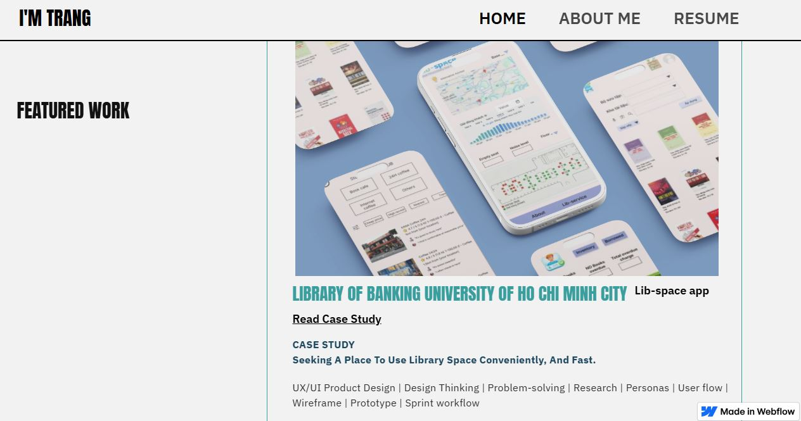

## About me!
I'm a final-year Management Information System (MIS) at Ho Chi Minh city of Banking university, pursuing Business Analyst career. To be a good Business Analyst, I have learnt projects regarding Data analysis, UX/UI, and also basic understanding of RESTapi in HTTP protocol.

  <a href="https://ux-portfolio-00e467.webflow.io/">
    
     
  </a>

  

### 📜 LANGUAGES & OFFICE INFORMATICS TESTIMONIALS:

| LANGUAGES | OFFICE INFORMATICS |
| :--- | :--- |
| **TOEIC**   [825/990 L+R](https://drive.google.com/file/d/1MF7_msCfa_AIiwWhlKJopG7KKr5-5laJ/view?usp=drive_link) | **MOS 2019 - Specialist (Excel, PowerPoint, Word)**    • [Microsoft Word Specialist 2019](https://drive.google.com/file/d/1PualKH2xM1FnVP9ag2BNruroeMpwxGT9/view?usp=drive_link)   • [Microsoft Excel Specialist 2019](https://drive.google.com/file/d/1omrOWr1FdWvWzT6c4J6iOQybP2-xwVgr/view?usp=drive_link)   • [Microsoft PowerPoint Specialist 2019](https://drive.google.com/file/d/1WR13LBj6Vm7v0I8HHej5seQdta-4u27b/view?usp=drive_link) |

### 🥇 Hand-On Projects:

| TOOL | TITLE | RECAPITULATION | PROJECT |
| :--- | :--- | :--- | :--- |
|  **POSTMAN API** |  Project-Based Learning: A weather app in Python | This project is my first step into the world of Business Analysis and software development. I designed a weather app, showcasing my skills in API basic understanding. |  [Click here to Find out](#Connected_OpenWeather_API_WeatherApp) |
|  **FIGMA** |  Lib-space app, Seeking A Place To Use Library Space Conveniently, And Fast. | As a part of self-study, I created an end2end UX project. Our Lib-seat app will let users monitor the library space in real-time, easily, and conveniently. This will affect students who want to use library services by allowing them to observe the library space effortlessly to find an empty seat for themselves. We will measure the effectiveness by the satisfaction, the sentiment, and the number of students using library services in surveys. |  [Click here to Find out](https://www.figma.com/proto/ZpeZz0pleU37NDXHjpr5t1/Lib-Space-HUB?node-id=29-27&t=eW4RsL2v1etZJT8y-1&scaling=scale-down&content-scaling=fixed&page-id=0%3A1&starting-point-node-id=29%3A27&show-proto-sidebar=1) |
|  **BALSAMIQ** |  Weather website wireframe | A wireframe using balsamiq helps me "draw" quickly my idea which is about weather website beyond weather app in Python, lauching a web for everyone easily use |  [Click here to Find out](https://balsamiq.cloud/s8c8m8e/pwfutf3) |

## 🔗 Let's Connect
* 🌐 **Website Portfolio:** [Visit My Website](https://ux-portfolio-00e467.webflow.io/)
* 💼 **LinkedIn:** [linkedin.com/in/trangnguyen](https://www.linkedin.com/in/nguyenhaphuongtrang/)
* 📧 **Email:** phuongtrangnguyenha.work@gmail.com
