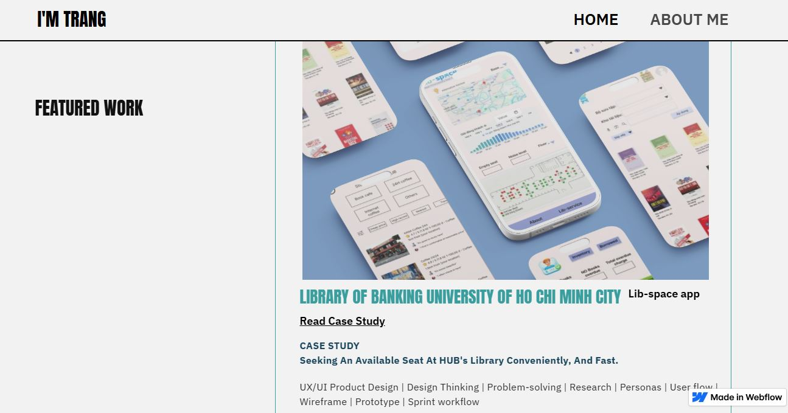

  <h1>Nguyễn Hà Phương Trang</h1>
  <h2>(Fresher Management Information System)</h2>
  <h3>🎓 DATA ANALYST | DATA OPERATIONS | DATA QUALITY | ANALYTICS ENGINEER</h3>
  

    🚀 Building data pipelines from raw data to clean, decision-ready insights 
    📊 Turning e-commerce data into practical dashboards & reports
  

   <h4 align="center">gmail: phuongtrangnguyenha.work@gmail.com</h4>

  

  <code>Data Analyst</code> | <code>Data Operations</code> | <code>Data Quality</code>

  &nbsp;
  

 My personal projects and certificates are attatched below, please take your time to look through. I hope we can work together if I have oppotunities.
*Some file pdf first you maybe encounter "unable to render" after clicking, please reload page or download file pdf.

## 🌐 Languages & Office Informatics

<table>
  <tr>
    <th align="center">LANGUAGES</th>
    <th align="center">OFFICE INFORMATICS</th>
  </tr>
  <tr>
    <td align="center" valign="top">
      <b>TOEIC</b>  
      <a href="https://drive.google.com/file/d/1sIk_gmI7wYqdhyTSFz_RJw5nsV6aeu_Q/view?usp=sharing">825/990 L+R & 320/400 S+W</a>
    </td>
    <td align="center" valign="top">
      <b>MOS 2016 — Specialist (Excel, PowerPoint, Word)</b>  
      <a href="https://drive.google.com/file/d/1PualKH2xM1FnVP9ag2BNruroeMpwxGT9/view?usp=drive_link">Microsoft Word Specialist 2016</a> 
      <a href="https://drive.google.com/file/d/1omrOWr1FdWvWzT6c4J6iOQybP2-xwVgr/view?usp=drive_link">Microsoft Excel Specialist 2016</a> 
      <a href="https://drive.google.com/file/d/1WR13LBj6Vm7v0I8HHej5seQdta-4u27b/view?usp=drive_link">Microsoft PowerPoint Specialist 2016</a>
    </td>
  </tr>
</table>

<h3 align="center">🛠️ Tech Stack & Tools</h3>

<table width="100%" align="center">
  <tr>
    <td width="45%">📥 <b>Ingest & Collect</b></td>
    <td>
      
      
      
      
    </td>
  </tr>
  <tr>
    <td>🛢️ <b>Store & Manage</b></td>
    <td>
      
      
      
      
    </td>
  </tr>
  <tr>
    <td>🔄 <b>Transform</b></td>
    <td>
      
    </td>
  </tr>
  <tr>
    <td>🛡️ <b>Data Quality</b></td>
    <td>
      
    </td>
  </tr>
  <tr>
    <td>🏷️ <b>Governance & Catalog</b></td>
    <td>
      
    </td>
  </tr>
  <tr>
    <td>📊 <b>BI & Analytics</b></td>
    <td>
      
      
      
    </td>
  </tr>
  <tr>
    <td>🚀 <b>CI/CD & GitOps</b></td>
    <td>
      
      
    </td>
  </tr>
  <tr>
    <td>📋 <b>Project & Knowledge</b></td>
    <td>
      
      
      
      
      
      
    </td>
  </tr>
  <tr>
    <td>💻 <b>IDE & Data Tools</b></td>
    <td>
      
      
    </td>
  </tr>
  <tr>
    <td><b>Front-end basics for semantic website </b></td>
    <td>HTML, CSS, JavaScript </td>
  </tr>
</table>

<h3 align="center">🏆 Certificates & Projects</h3>

  
  
  
  
  
  
  
  
   
  
  
  
  
  
  
  
  
  
  
  
  

  &nbsp;chứng chỉ chính thức, có bằng cấp/link xác thực &nbsp;&nbsp;
  &nbsp; based-learning project

---

## 🎓 Certificates (Chứng chỉ chính thức)

### 📊 Data Build Tool (dbt)

<table width="100%">
  <tr>
    <td width="100%" valign="top">
       
      <b>dbt Fundamentals</b> 
      🏷️ dbt Labs  
      <a href="https://credentials.getdbt.com/b555353d-be5e-4ead-a644-63345152fb3a#acc.4cK3QRie">🔗 View Certificate</a>
    </td>
  </tr>
</table>

### 🗄️ SQL

<table width="100%">
  <tr>
    <td width="33%" valign="top">
       
      <b>SQL — Intermediate</b> 
      🏷️ HackerRank  
      <a href="https://www.hackerrank.com/certificates/iframe/284f95144627">🔗 View Certificate</a>
    </td>
    <td width="33%" valign="top">
       
      <b>SQL — Intermediate</b> 
      🏷️ Xóm Data — JOIN, Subquery, CASE WHEN, hàm chuỗi/ngày tháng  
      <a href="https://xomdata.com/certificates/XA-JLYXJF">🔗 View Certificate</a>
    </td>
    <td width="33%" valign="top">
       
      <b>SQL — Advanced</b> 
      🏷️ Xóm Data — Window Functions, CTE, Set Operations, RFM/Gap/Funnel  
      <a href="https://xomdata.com/certificates/XA-FQY7Q4">🔗 View Certificate</a>
    </td>
  </tr>
</table>

### 🐍 Python, AI & Modern Tools

<table width="100%">
  <tr>
    <td width="20%" valign="top">
       
      <b>Crash Course on Python</b> 
      🏷️ Coursera  
      Data Types; Data Structures & Methods- List, Dictionary, Tuple, Set; Programming: for loop, while, lambda function, comprehensive functions.  
      <a href="https://coursera.org/share/402da06fb2f9a4f2e9b19f6d9137d9d1">🔗 View Certificate</a>
    </td>
    <td width="20%" valign="top">
       
      <b>Python - Intermediate</b> 
      🏷️ Coursera  
       Khóa học Python Trung cấp dành cho người đã hoàn thành Python Cơ bản. Bạn sẽ học cách viết hàm chuyên nghiệp, thành thạo list comprehension, dictionary, set, xử lý lỗi và áp dụng vào các bài toán xử lý dữ liệu thực tế — nền tảng vững chắc trước khi học Pandas và Data Analysis.   
      <a href="https://xomdata.com/certificates/XA-M6CTV2">🔗 View Certificate</a>
    </td>
    <td width="20%" valign="top">
       
      <b>AI Essentials</b> 
      🏷️ Coursera  
      <a href="https://www.coursera.org/account/accomplishments/verify/BFQNAH1IO5VP">🔗 View Certificate</a>
    </td>
    <td width="20%" valign="top">
       
      <b>Claude 101</b> 
      🏷️ Anthropic  
      <a href="certificate_claude.pdf">🔗 View Certificate</a>
    </td>
    <td width="20%" valign="top">
       
      <b>Postman API</b> 
      🏷️ Postman  
      <a href="Postman_cert.JPG">🔗 View Certificate</a>
    </td>
  </tr>
</table>

### 📈 Data Analytics & Marketing

<table width="100%">
  <tr>
    <td width="33%" valign="top">
       
      <b>Data Analytics Professional</b> 
      🏷️ Google  
      <a href="https://coursera.org/share/443949fc903e2df4934bb92b2474b70e">🔗 View Certificate</a>
    </td>
    <td width="33%" valign="top">
       
      <b>Digital Marketing & E-commerce</b> 
      🏷️ Google  
      <a href="https://coursera.org/share/1a83ea1c580f5a103bcbda9225415415">🔗 View Certificate</a>
    </td>
    <td width="33%" valign="top">
       
      <b>Quantitative Techniques</b> 
      🏷️ Columbia+  
      <a href="https://images.credential.net/embed/47yhsf7p_1781027352398.png">🔗 View Certificate</a>
    </td>
  </tr>
</table>

### 📋 Project Management & Agile

<table width="100%">
  <tr>
    <td width="33%" valign="top">
       
      <b>Project Management Professional</b> 
      🏷️ Google  
      <a href="https://www.coursera.org/account/accomplishments/specialization/9EH20KD7OCLC">🔗 View Certificate</a>
    </td>
    <td width="33%" valign="top">
       
      <b>Agile Essentials</b> 
      🏷️ Google  
      <a href="https://www.coursera.org/account/accomplishments/specialization/93RTQLJUZ9PA">🔗 View Certificate</a>
    </td>
    <td width="33%" valign="top">
       
      <b>Agile Project Management with Jira Cloud</b> 
      🏷️ LinkedIn Learning — Projects, Boards, Issues  
      <a href="https://www.linkedin.com/learning/certificates/8b15db94aeaf3e5e4c36e749f4920ad147c90d64b32e697738e2a8de52e719b2">🔗 View Certificate</a>
    </td>
  </tr>
</table>

---

## 🛠️ Projects (Based-learning project)

### 🛍️ Business Project

<table width="100%">
  <tr>
    <td width="50%" valign="top">
       
      <b>Aomen Shop</b> 
      🏷️ E-commerce Management (University coursework) — Shopify  
      Dự án kinh doanh thời trang nam trên Shopify: business canvas model, marketing plan. Phụ trách market research, xây dựng mô hình kinh doanh fictional shop, lên kế hoạch digital marketing, vận hành shop (upload sản phẩm).  
      <a href="https://drive.google.com/file/d/1jhWhHeDzSyX1aMxwFkYmMHcP173bS1_r/view?usp=sharing">🔗 View Project</a>
    </td>
      <td width="50%" valign="top">
       
      <b> Digital Marketing Proposal </b> 
      🏷️ A fiction fashion shop   
      Đề xuất kế hoạch digital marketing dựa trên dữ liệu.  
      <a href="https://github.com/TrangDataforlife/Marketing_Proposal">🔗 View Project</a>
    </td>
  </tr>
</table>

### 🔄 Data Engineering Projects

<table width="100%">
  <tr>
    <td width="25%" valign="top">
       
      <b>dbt Fundamentals Project</b> 
      🏷️ dbt + Snowflake — Credit: dbt Labs  
      Dataset <code>Jaffle_shop</code> trên Snowflake. Refactor model thành staging & marts, modularity, Jinja & macros, singular/generic testing, documentation.  
      <a href="https://github.com/TrangDataforlife/dbt_fundamentals">🔗 View Project</a>
    </td>
    <td width="25%" valign="top">
       
      <b>Kimball Dimensional Model</b> 
      🏷️ dbt — Credit: Jonathan Neo (Data Engineer @ Canva)  
      Thực hành khái niệm Kimball dimensional modelling.  
      <a href="https://github.com/TrangDataforlife/dbt-dimensional-modelling">🔗 View Project</a>
    </td>
    <td width="25%" valign="top">
       
      <b>Netflix S3 → Snowflake → dbt</b> 
      🏷️ dbt — Credit: Darshil Parmar  
      Incremental model, SCD type 1/2, Snapshot, surrogate key (<code>dbt_utils</code>). Dataset MovieLens 20M từ S3 → Snowflake → dbt.  
      <a href="https://github.com/TrangDataforlife/netflix_S3_Snowflake_dbt">🔗 View Project</a>
    </td>
    <td width="25%" valign="top">
       
      <b>Customer Shopping Behaviour Analysis</b> 
      🏷️ PostgreSQL, Python, Power BI  
      ETL pipeline với PostgreSQL, Python, Power BI, kèm findings presentation.  
      <a href="https://github.com/TrangDataforlife/customer_trends_data_analysis_PostgreSQL_Python_PowerBI/tree/main">🔗 View Project</a>
    </td>
  </tr>
</table>

### 📊 Data Analysis Projects

<table width = '100%'>
  <tr>
    <td width="33%" valign="top">
       
      <b>Customer Cohort Analysis</b> 
      🏷️ Python   
        Phân tích retention rate trong lĩnh vực bán lẻ   
      <a href="https://github.com/TrangDataforlife/Cohort-Analysis">🔗 View Project</a>
    </td>
    <td width="33%" valign="top">
       
      <b>E-commerce Analysis</b> 
      🏷️ Python   
        Phân tích dữ liệu trong thương mại điện tử   
      <a href="https://github.com/TrangDataforlife/E-commerce-Analysis-with-Python.git">🔗 View Project</a>
    </td>
  </tr>
</table>

<table width="100%">
  <tr>
    <td width="33%" valign="top">
       
      <b>HR Analysis Dashboard</b> 
      🏷️ Power BI  
      Foundation data analysis skills và findings presentation trên Power BI.  
      <a href="https://github.com/TrangDataforlife/HR_Dashboard">🔗 View Project</a>
    </td>
    <td width="33%" valign="top">
       
      <b>Digital Logistics & Sales Analysis</b> 
      🏷️ Power BI  
      . Foundation data analysis skills và findings presentation trên Power BI. 
      <a href="https://github.com/TrangDataforlife/PowerBI_Logistics_and_Sales_Analysis">🔗 View Project</a>
    </td>
    <td width="33%" valign="top">
       
      <b>Digital Marketing Performance Analysis</b> 
      🏷️ Notion, Google Looker Studio, Power BI  
      Lưu trữ portfolio phân tích dữ liệu bằng Notion, phân tích với Looker Studio & Power BI.  
      <a href="https://app.notion.com/p/Data-Analyst-Portfolio-practice-tool-21d8ba8ff45c80f1b741c2dae08d7a9a">🔗 My Data Analyst Portfolio</a>
    </td>
  </tr>
</table>

### 🔌 API Projects

<table width="100%">
  <tr>
    <td width="33%" valign="top">
       
      <b> [TopCV] Web Scrapper (jupyter notebook & VS Code) environment </b> 
      🏷️ using BeautifulSoup, Requests library & github actions   
      Project phục vụ việc học sử dụng python để thu thập dữ liệu trên TopCV bằng API.  
      <a href="https://github.com/TrangDataforlife/-TopCV-Web-Scrapper">🔗 View Project</a>
    </td>
    <td width="33%" valign="top">
       
      <b>Extract Data with YouTube V3 API</b> 
      🏷️ YouTube API  
      Lấy danh sách comment của 1 video YouTube.  
      <a href="https://github.com/TrangDataforlife/apiYoutube">🔗 View Project</a>
    </td>
    <td width="33%" valign="top">
       
      <b>Weather App</b> 
      🏷️ Postman API, Python — Credit: Coding with Evan  
      Bước đầu vào Business Analysis & software development, thực hành hiểu API cơ bản.  
      <a href="https://github.com/TrangDataforlife/Connected_OpenWeather_API_WeatherApp">🔗 View Project</a>
    </td>
  </tr>
</table>

### 🎨 Product & UX Design Projects

  <a href="https://ux-portfolio-00e467.webflow.io/project/the-main">
    
     
  </a>

  

<table width="100%">
  <tr>
    <td width="33%" valign="top">
       
      <b>[AI Recruitment Suite]</b> 
      🏷️ Google Stitch, Draw.io — Entry test PO tại Edtronaut  
      AI Suite tối ưu hóa quy trình tuyển dụng: hỗ trợ đánh giá năng lực ứng viên qua bài mô phỏng thực chiến, báo cáo định lượng, rút ngắn Time-to-hire.  
      <a href="https://drive.google.com/file/d/1vzIVHC3XRhbQ7GMbFOMao1jgCOVIFU89/view?usp=sharing">🔗 View Project</a>
    </td>
    <td width="33%" valign="top">
       
      <b>Family Farm — Sales Management System</b> 
      🏷️ Figma, Google Stitch, StarUML, Draw.io — Teamwork (7 thành viên)  
      Đồ án Information System Analysis and Design: phân tích business requirements, use case diagram, DFDs, BPMN, ERD, Prototype cho cửa hàng rau củ trực tuyến giả định.  
      <a href="https://github.com/TrangDataforlife/Information_Systems_Analysis_and_Design">🔗 View Project</a>
    </td>
    <td width="33%" valign="top">
       
      <b>Lib-Space App</b> 
      🏷️ Figma — Self-study UX end-to-end  
      Giúp sinh viên theo dõi tình trạng chỗ ngồi thư viện HUB theo thời gian thực, dễ dàng tìm chỗ trống.  
      <a href="https://www.figma.com/proto/ZpeZz0pleU37NDXHjpr5t1/Lib-Space-HUB?node-id=29-27&t=eW4RsL2v1etZJT8y-1&scaling=scale-down&content-scaling=fixed&page-id=0%3A1&starting-point-node-id=29%3A27&show-proto-sidebar=1">🔗 View Project</a>
    </td>
  </tr>
  <tr>
    <td width="33%" valign="top">
       
      <b>Weather Website Wireframe</b> 
      🏷️ Balsamiq  
      Wireframe nhanh ý tưởng mở rộng weather app Python thành 1 website cho mọi người dễ dùng.  
      <a href="https://balsamiq.cloud/s8c8m8e/pwfutf3">🔗 View Project</a>
    </td>
    <td width="33%" valign="top">
       
      <b>Balsamiq Workspace</b> 
      🏷️ Balsamiq — Image Hands-on  
      <a href="https://github.com/TrangDataforlife/Balsamiq-workspace/blob/main/README.md">🔗 View Project</a>
    </td>
    <td width="33%" valign="top">
       
      <b>SCRUM Practices in Google Sheets</b> 
      🏷️ SCRUM — theo Google Agile Essentials  
      Mô phỏng Sprint workflow cho 1 công ty giả định.  
      <a href="https://docs.google.com/spreadsheets/d/18Bm-vE0J34J1SuZF5xliWIBnMAlyljvlv87KgwBsGAY/edit?usp=sharing">🔗 View Project</a>
    </td>
  </tr>
</table>

## 🔗 Let's Connect
* 🌐 **Website UX/UI - Product Owner Portfolio:** [Visit My Website](https://ux-portfolio-00e467.webflow.io/)
* 💼 **LinkedIn:** [linkedin.com/in/trangnguyen](https://www.linkedin.com/in/nguyenhaphuongtrang/)
* 📧 **Email:** phuongtrangnguyenha.work@gmail.com
